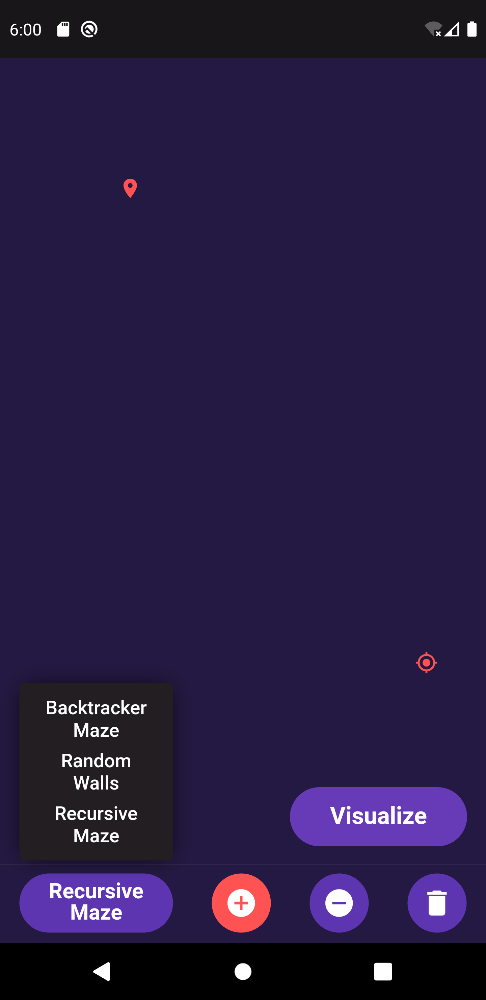
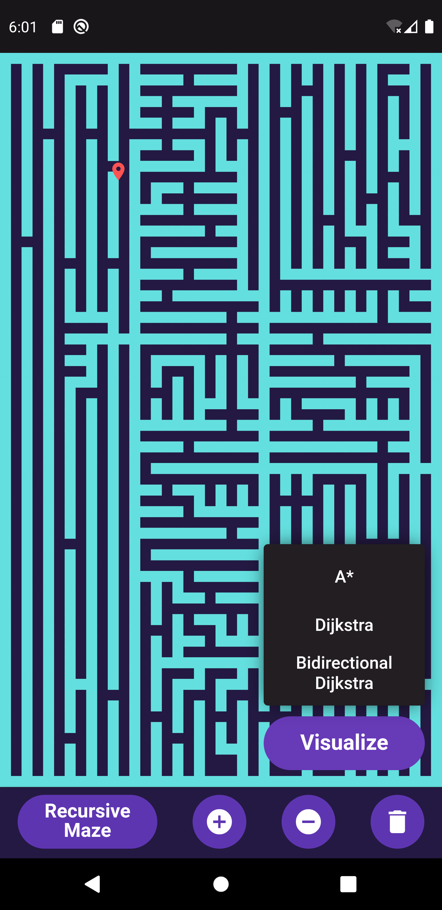
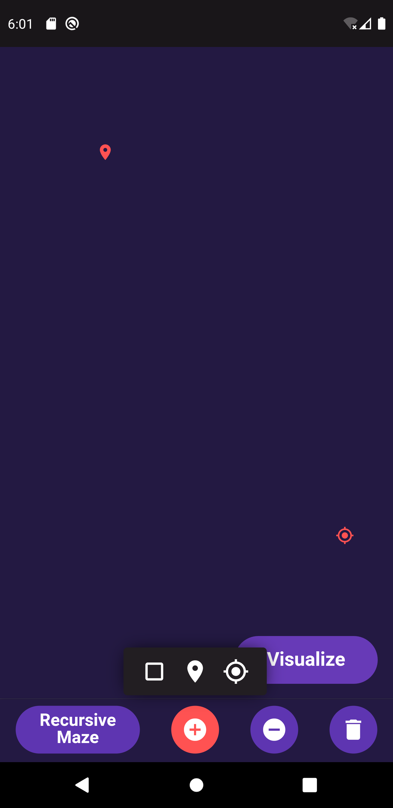
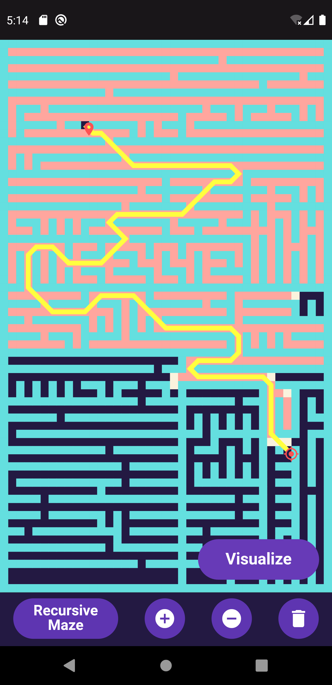

# Pathfinding Algorithms Visualizer

## Steps to use:-

1. Long press the Maze button to choose select the maze of your choice and press it again to build the maze and then press visualize.

2. Long Press the visualize button to reveal the list of algorithms avaliable, currently supports A*, Dijkstra and Bidirectional Dijkstra.

3. You can also use the plus button to add walls and long press to select the modes to move the starting and the ending node.
4. Use the minus button to remove walls at specific location and the delete button to clear the board and start fresh.
